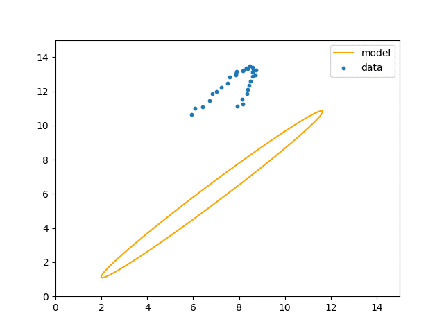

# Ellipse Fitting
A noisy data is sampled from a 2-D ellipse. The task is to estimate parameters of this ellipse from the data.

The correspondences on the parametric curve are simultaneously minimized along with the ellipse parameters (`theta` in code) using Leverberg-Marquardt (LM) nonlinear optimizer.
The LM implementation is inspired from [tensorflow_graphics](https://github.com/tensorflow/graphics/blob/master/tensorflow_graphics/math/optimizer/levenberg_marquardt.py).

Thanks to Andrew Fitzgibbon for this trick(http://www.fitzgibbon.ie/bmvc15_tutorial).

## Result


## Setup
The code uses `python3`.
Assuming `python3-pip` is installed (specifically use a [virtual environment](https://docs.python.org/3/library/venv.html)), the dependencies can be installed using
```bash
pip install -r requirements.txt
```

## Steps
1. Visualize data
```python
python data.py
```

2. Fit ellipse to data
```python
python minimize.py
```
To use tensorflow's implementation of Levenberg Marquardt algorithm, add the optional argument `-tf`.
