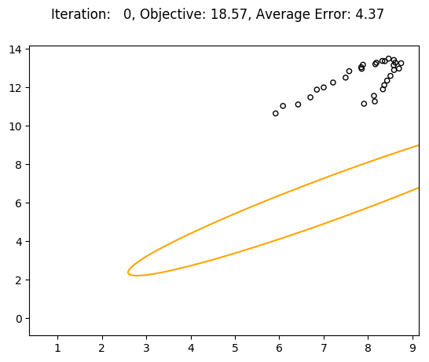

# Ellipse Fitting
A noisy data is sampled from a 2-D ellipse. The task is to estimate parameters of this ellipse from the data.

The correspondences on the parametric curve are simultaneously minimized along with the ellipse parameters using Leverberg-Marquardt (LM) nonlinear optimizer.
The LM implementation is inspired from [tensorflow_graphics](https://github.com/tensorflow/graphics/blob/master/tensorflow_graphics/math/optimizer/levenberg_marquardt.py).

Thanks to Andrew Fitzgibbon for this trick(http://www.fitzgibbon.ie/bmvc15_tutorial).

## Result
**True Parameters**: [3, 2, 5, 4, 5, 7]

**Fitted (using squared error) Parameters**: [1.88, 2.82, 5.24, 1.61, 5.38, 7.79]

**Fitted (using absolute error) Parameters**: [1.86, 2.62, 5.36, 1.64, 5.08, 8.06]

### Squared Error  Metric


### Absolute Error  Metric


Note: The objective values cannot be compared, because they depend on the metric used.

## Setup
The code uses `python3`.
Assuming `python3-pip` is installed (specifically use a [virtual environment](https://docs.python.org/3/library/venv.html)), the dependencies can be installed using
```bash
pip install -r requirements.txt
```

## Running Code
```python
python data.py [-m squared]
```

